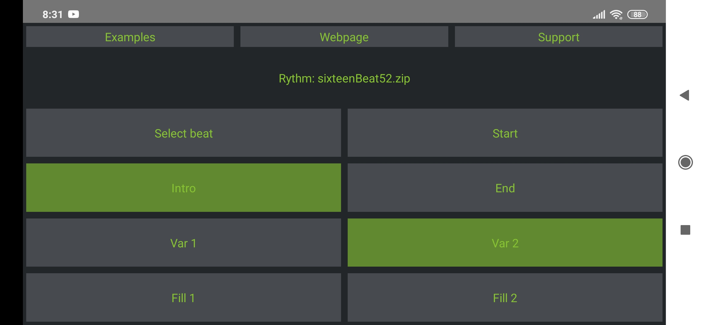

# RhyhtmiFix



RhythmiFix is a sound track controller application. It supports gapless looping and is thus perfect to use as 
a drum machine. The app supports

* Enable/disable intro track
* Ending
* Switching between two variations of the track
* Two interruptions for each variation

The app essentially plays a main-track in a loop. On request, interruptions like drum fills can be inserted to the queue.

# File Format

To create your own playback, you create or get a recording of the different parts of the song. It is important
that you put all the different parts in a folder named **tracks**. Within that folder, also place a JSON file that
describes the song. This file must be named **info.json**.

```json
{
    "author": "David Kleiven",
    "name":  "16Beat",
    "description": "16 beat pop groove",
    "tracks": {
        "intro": "sixteenBeatIntro.wav",
        "end": "sixteenBeatEnd.wav",
        "var1": {
            "main": "sixteenBeatMain1.wav",
            "fill1": "sixteenBeatV1Fill1.wav",
            "fill2": "sixteenBeatV1Fill2.wav"
        },
        "var2": {
            "main": "sixteenBeatMain2.wav",
            "fill1": "sixteenBeatV2Fill1.wav",
            "fill2": "sixteenBeatV2Fill2.wav"
        }
    }
}
```

Once you have populated the **tracks** folder with all the sound files and the **info.json** file,
zip the **tracks** folder and make it available on your phone (transfer it, put it on some cloud service you have access to etc.),
and you are ready to use your playback! Note that if desired, the same recording can be listed several times (for example if you want to
have the same fills in variation 1 and variation 2). For the example above the **tracks** folder contains

```
tracks/
    info.json
    sixteenBeatIntro.wav
    sixteenBeatEnd.wav
    sixteenBeatMain1.wav
    sixteenBeatV1Fill1.wav
    sixteenBeatV1Fill2.wav
    sixteenBeatMain2.wav
    sixteenBeatV2Fill1.wav
    sixteenBeatV2Fill2.wav
```

You can find several example tracks on [Google Drive](https://drive.google.com/drive/folders/1DKWbsj0MkGPuLBlNI9Op6xhiyt0_zJE0?usp=sharing).

On Unix you can zip a folder by

```bash
zip -r myrhythm.zip tracks/
```

# Contact/Support

If you have questions, don't hessitate to open an issue here or send me an [email](mailto:davidkleiven446@gmail.com).